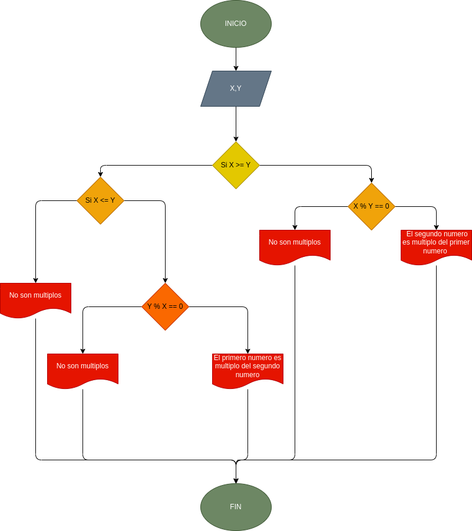

# Ejercico. programa que lea dos numeros enteros y averigues si el uno es multiplo del otro

## Definicion de variables

#### X = pimer numero entero
#### Y = segundo numero entero

## Diagrama de flujo 

